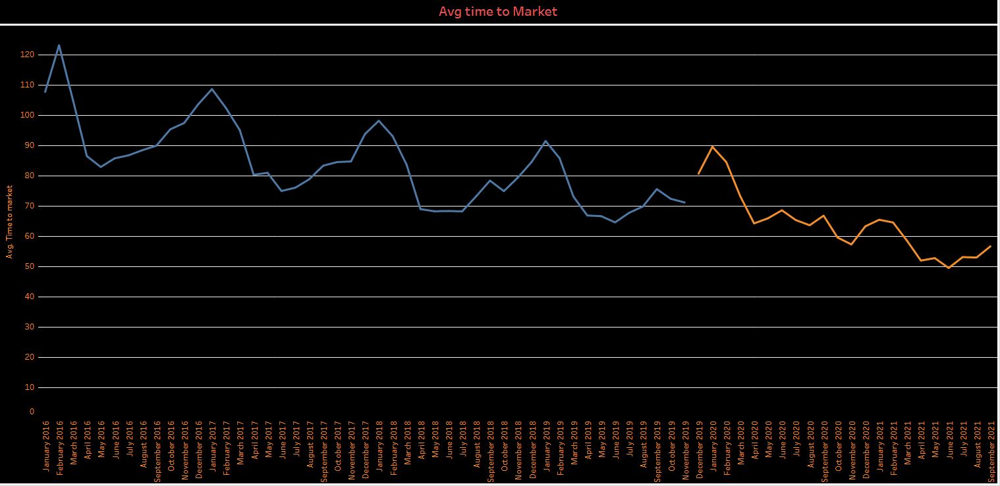
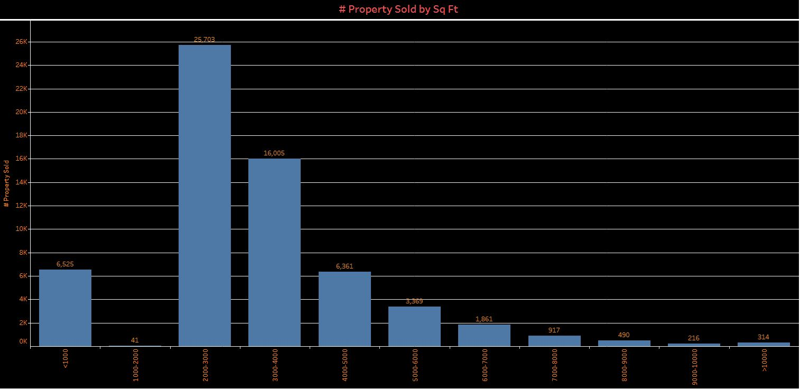

# Final_Project

### Communication Protocol

Assigned roles:

Square --> Nicole
Triangle --> Swapna
Circle --> Adam
X --> rakan

we are connecting Regularly Via Slack and having zoom meetings when needed.

### **tools used**

in this part of the project my role was to analyse data using visualizations therefore I have utilized Tableau.

### **Results**

 
 
 
 
 
 
 
 
 
  
  
  
  
 
 
 
 
 
 
 
 
 
 
 

 
 
 
 
 
 
 
 ### ** Tableau**
 
 Link:   https://public.tableau.com/app/profile/rakan.alsharif/viz/Dashboard_16320975806010/Dashboard
 
 
 

 
 
 
 

