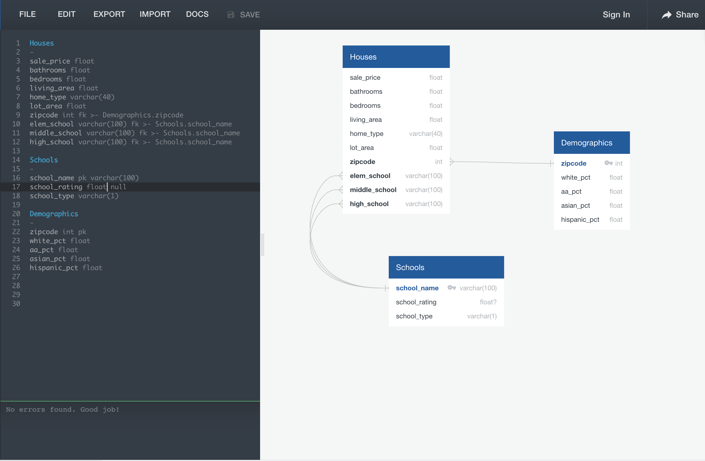
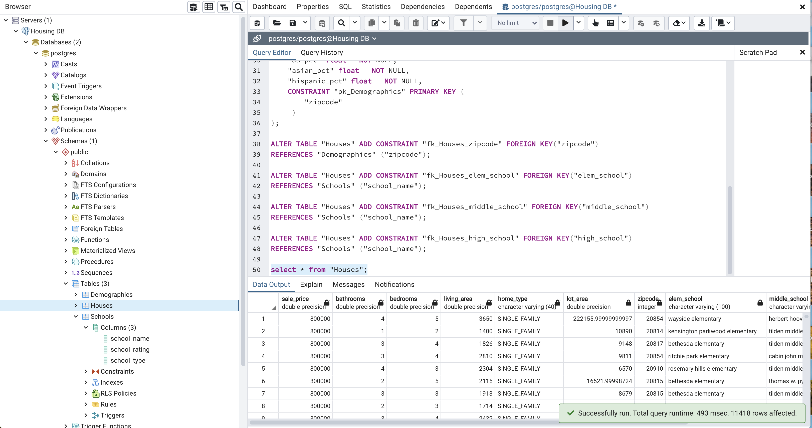
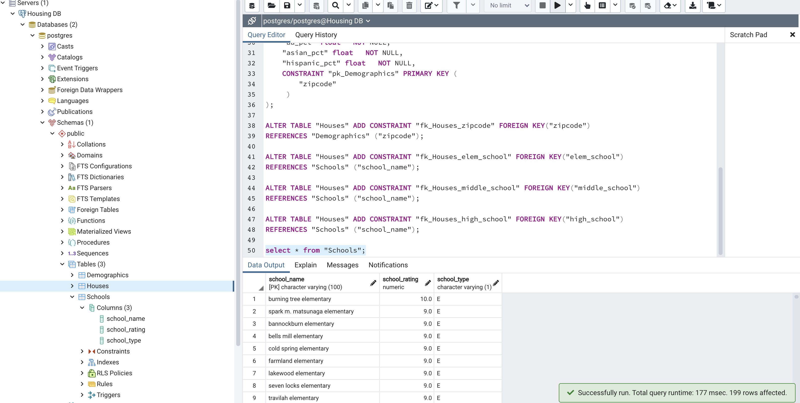
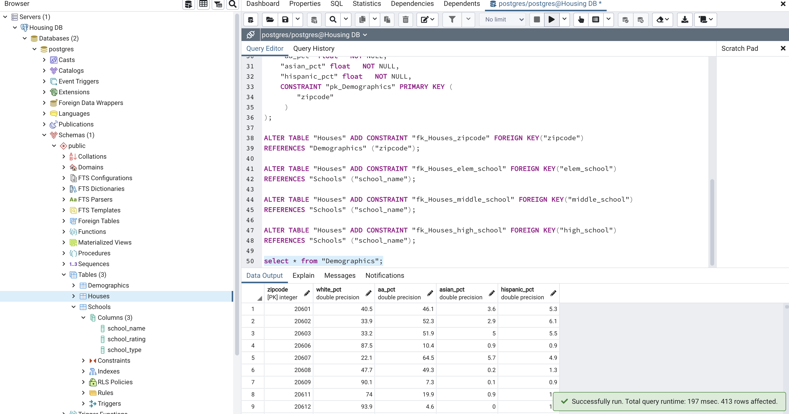
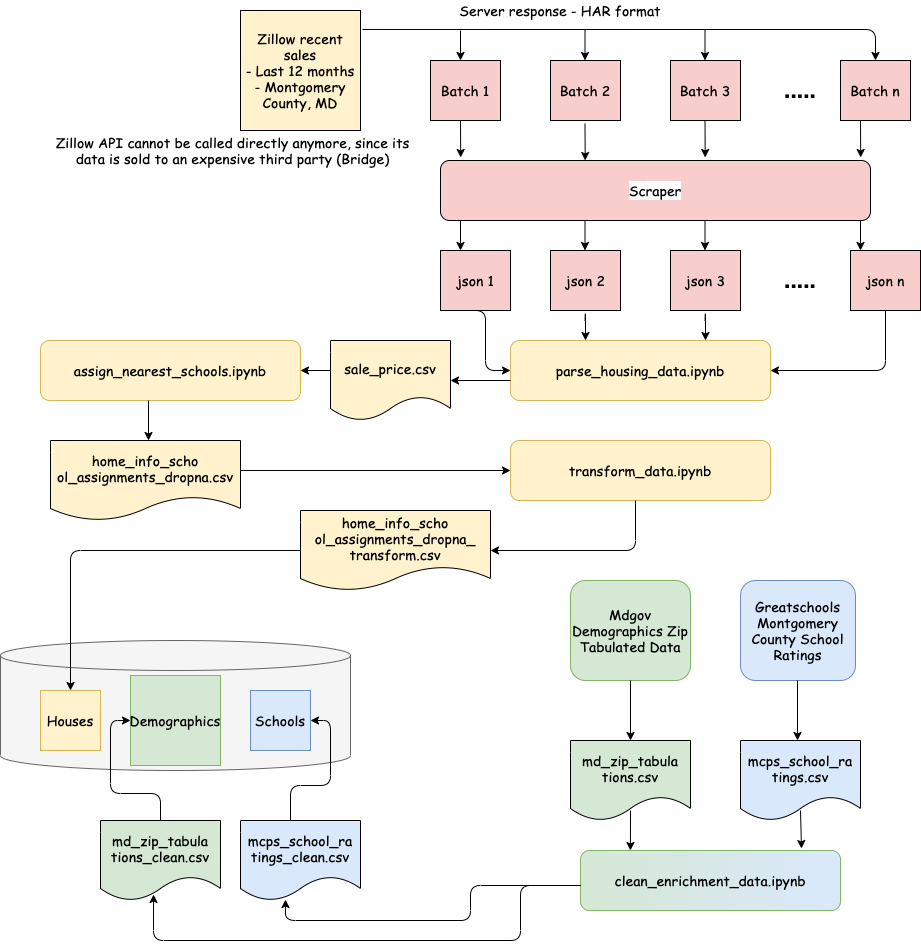

# Data Collection, Transformation and Storage

## Data Collection

### House Sales Data

Raw house sales data was collected from Zillow by extracting all *sold housses* in Montgomery County, MD from August 2020 until August 2021. The data has following important characteristics:

* Complete address
* Lattitude and Longitude
* Sale price
* Z-estimate
* Square footage
* Number of bedrooms
* Number of bathrooms

The following method was applied to scrape useful attributes from the Zillow data.

* By successively setting appropriate filters (so as not to let Zillow exceed the total dataset size over 500 and cause pagination), data was retrieved on the Zillow portal.
* From the developers tool, the API response was downloaded - it is downloaded in the *HAR* format.
* The following free tool is used to scrape the HTML response and dump the output in JSON: https://stevesie.com/apps/zillow-api. This tool scrapes data in HAR files of the server response and populates them in a json file.
* Jupyter notebook code was written to read attributes from the json files and populate a dataframe. Eventually, the dataframe was exported to a csv file. This code is available [here](montgomery-county-sales/parse_housing_data.ipynb).

### School Ratings Data

Elementary, middle and high school ratings data for all Montgomery County, MD schools has been extracted from Greatschools: https://www.greatschools.org/

### Demographics Data

The 2020 demographics data for all Maryland zip codes is avaulable from the Maryland government website here: https://data.imap.maryland.gov/datasets/eb706b48117b43d482c63d02017fc3ff/explore?location=38.817745%2C-77.268400%2C8.60

**Warning**: This data is extremely hard to get though publicly available. It takes a lot of trial and error and patience.

## Data Transformation and Cleaning

### School Assignment

For each school, elementary, middle and high school assignment is determined using gmap places API. The code to do this is [here](montgomery-county-sales/assign_nearest_schools.ipynb). **Warning: Over 30K gmap API calls can result with this code, and it should be used only during the free trial period**. The logic basically finds geographically nearest schools to a given location and treats these schools as assigned schools (this may not always be accurate as district boundaries can be different, but for the most part, it is accurate).

After assigned schools are found, they are added to new columns of the original dataframe, and all rows with even a single unassigned school are dropped. When adding assigned schools, we make sure the said school exists in the Montgomery County school ratings data found earlier.

### Data Transformation and Cleaning

In this phase, the unneeded columns are dropped, all null rows are dropped and the *lotAreaValue* attribute is normalized by converting all values in hectar units to those in sq. feet. Also, all house types other than a condo, single family and townhouse are dropped, since there are too few of them. Finally, the transformed and cleaned data is exported to a csv file. The code is [here](montgomery-county-sales/transform_data.ipynb). The following columns are retained as they are the most important predictors of the sale price:

* Price - this is the target itself
* Number of bathrooms
* Number of bedrooms
* Home type (apartment, single family or townhouse)
* Living area (in sq. feet)
* Lot area (in sq. feet)
* Zipcode (for enrichment with demographics data)
* Assigned elementary school
* Assigned middle School
* Assigned high school

### Enrichment Metadata Cleaning

In this phase, school names are normalized to be able to match them against the housing data. Also, unneeded columns from both the school and demographics data are dropped. The code is [here](montgomery-county-sales/clean_enrichment_data.ipynb).

## Data Loading

Data is loaded in an RDBMS spinned using the AWS RDS service. The *entity relationship diagram* (ERD) for the three entities is shown below.

The *data definition language* (DDL) generated for the above ERD is [here](ontgomery-county-sales/ddl.sql). Tables are created using this DDL and data is imported to those tables from the respective csv files. The pictures below show the imported data and the appropriate number of rows for each table.

| Houses Table | Schools Table | Demographics Table |
| ------------ | ------------- | ------------------ |
|  |  |  |

## Complete Data Pipeline

The picture below shows the complete data pipeline including data sources, the Jupyter code files names to transform data, and all intermediate and eventual csv files generated for loading data to database tables.

