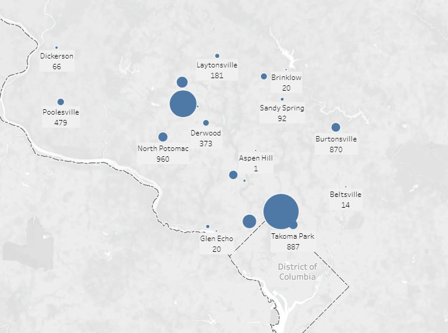
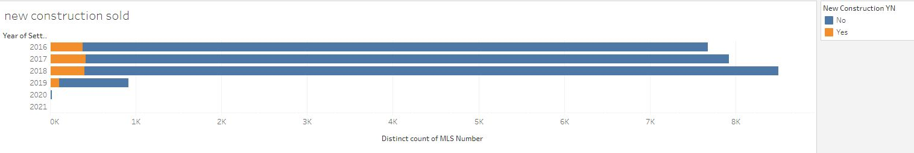
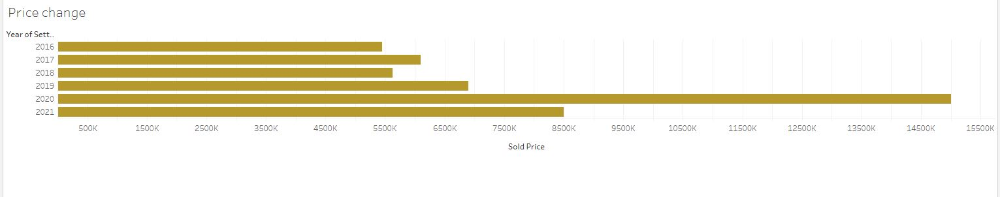
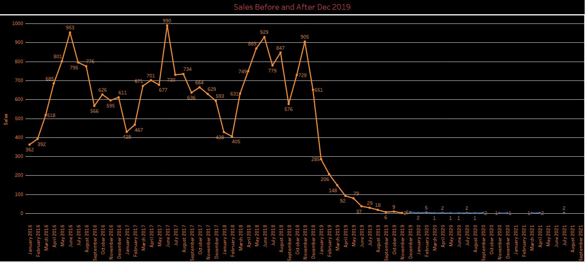

# Final_Project

### Communication Protocol

Assigned roles:

Square --> Nicole
Triangle --> Swapna
Circle --> Adam
X --> rakan

we are connecting Regularly Via Slack and having zoom meetings when needed.

### **tools used**

in this part of th eproject my role was to analyse data using visualizations therefore I have utilized Tableau.

### **Results**

 
 
 
 
 
 
 
 
 
 
 
  
  
  
  
   

 
 
 
 

